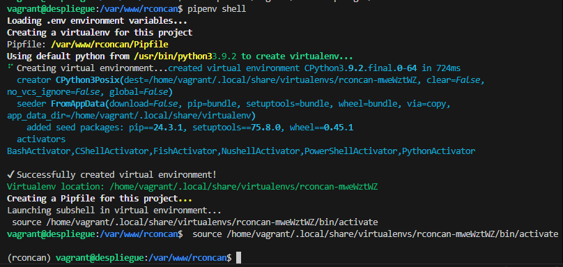
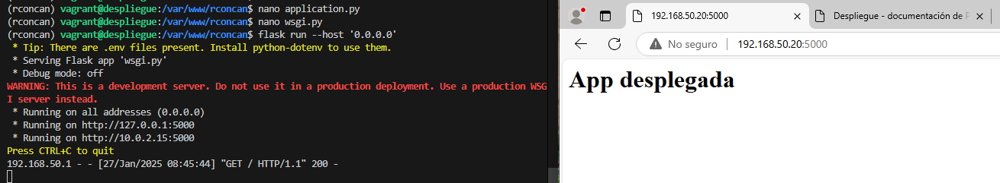
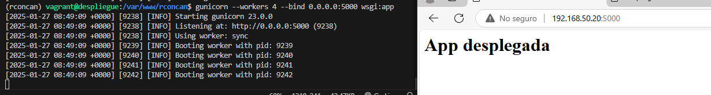
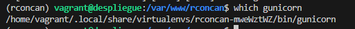
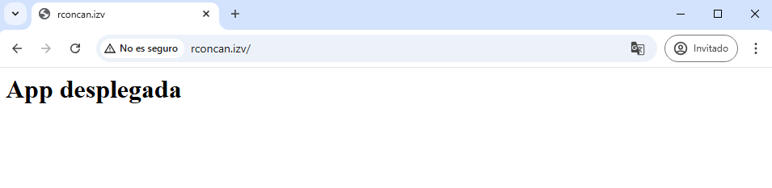

# Despliegue de Python con Flask y Gunicorn
## Primer ejemplo
Luego de instalar los gestores de paquetes y entornos virtuales creamos el fichero oculto .env indicando cuál es el archivo .py de la aplicación y el entorno

<a href="conf-despliegue/.env">Fichero .env</a>

Tras iniciar el entorno virtual creamos una aplicación Flsk simple con los archivos application.py, que es el que contendrá la aplicación, y el wsgi.py se encargará únicamente de iniciarla y dejarla corriendo.
<a href="conf-despliegue/application.py">Archivo application.py</a>
<a href="conf-despliegue/wsgi.py">Archivo wsgi.py</a>

Despliegue con Flask

Despliegue con Gunicorn

Buscamos la ruta de gunicorn

Ya fuera de nuestro entorno virtual, crearemos un archivo para que systemd corra Gunicorn como un servicio del sistema más
<a href="conf-despliegue/rconcan.service">Archivo rconcan.service</a>

Creamos el archivo rconcan.conf en /etc/nginx/sites-available como en este ejemplo.
<a href="conf-despliegue/rconcan.conf">Archivo rconcan.conf</a>

Finalmente accedemos a la app mediante la url

